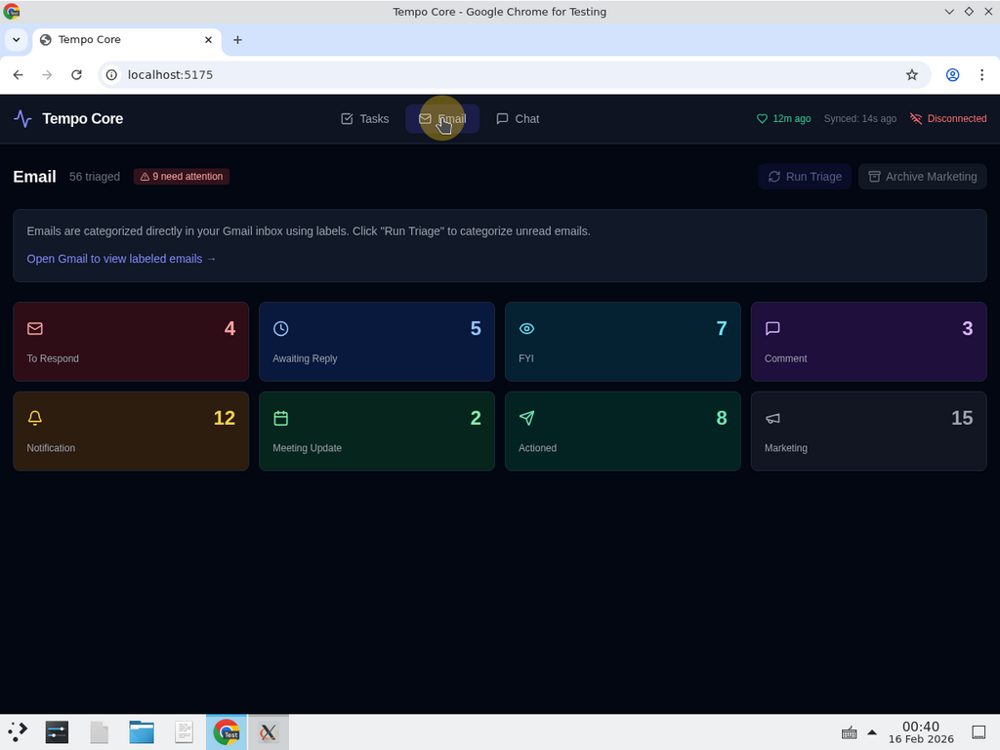
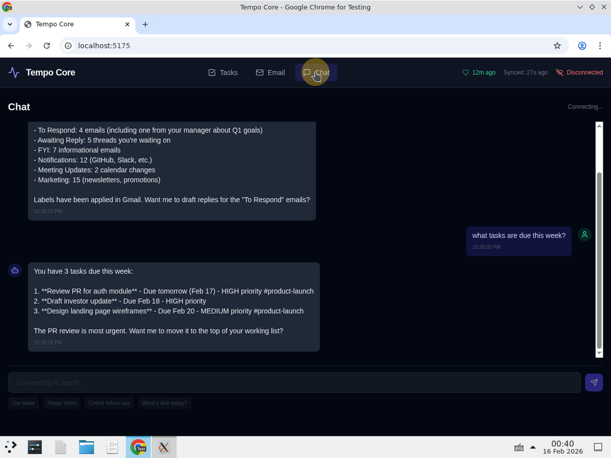

# OpenClaw Productivity Agent

A ready-to-run [OpenClaw](https://openclaw.com/) agent configuration with a dashboard UI, plugins, and skills for **task management** and **email management**. Built on Gmail and Obsidian — no database required.

Originally extracted from [Tempo](https://github.com/jdanjohnson/tempo-assistant), a personal AI Chief of Staff system built by [Ja'dan Johnson](https://github.com/jdanjohnson), a designer and technologist focused on human-centered AI. This repo packages the core productivity features into a standalone, configurable starting point that anyone can fork, extend, and make their own.

```
┌─────────────────────────────────────────────────────────┐
│                    User Touchpoints                      │
│                                                          │
│  ┌──────────┐  ┌──────────┐  ┌──────────┐  ┌─────────┐ │
│  │ Obsidian  │  │  Gmail   │  │ Telegram │  │  Web UI │ │
│  │  (vault)  │  │ (labels) │  │  (bot)   │  │(command)│ │
│  └─────┬────┘  └────┬─────┘  └────┬─────┘  └────┬────┘ │
│        │             │             │              │      │
│  ┌─────┴─────────────┴─────────────┴──────────────┴───┐ │
│  │              OpenClaw Gateway (agent)               │ │
│  │                                                     │ │
│  │  ┌────────────┐  ┌────────────┐  ┌──────────────┐  │ │
│  │  │   Tasks    │  │   Email    │  │  Follow-ups  │  │ │
│  │  │ (vault IO) │  │ (Gmail API)│  │  (hybrid)    │  │ │
│  │  └────────────┘  └────────────┘  └──────────────┘  │ │
│  │                                                     │ │
│  │  ┌────────────┐  ┌────────────────────────────────┐ │ │
│  │  │ Heartbeat  │  │  Skills: task-planner,         │ │ │
│  │  │ (30m cycle)│  │  email-composer                │ │ │
│  │  └────────────┘  └────────────────────────────────┘ │ │
│  │                                                     │ │
│  │           Single Model (Gemini 2.0 Flash)           │ │
│  └─────────────────────────────────────────────────────┘ │
└─────────────────────────────────────────────────────────┘
```

## Screenshots

### Task Board — Kanban view with project tags, priorities, and AI-assigned tasks


### Email Summary — 8-category inbox triage with Gmail label counts


### Chat — Natural language agent interface with quick commands


---

## What's Included

This repo gives you a complete OpenClaw agent setup out of the box:

- **16 registered tools** — Task CRUD, email triage, follow-up tracking, board sync, and more via an OpenClaw plugin
- **2 skills** — `task-planner` (brain dump to structured tasks) and `email-composer` (draft replies)
- **Dashboard UI** — React/Vite/Tailwind command center with Kanban board, email overview, and agent chat
- **Heartbeat system** — Proactive 30-minute checks for deadlines, blocked work, and unanswered emails
- **Telegram integration** — Mobile notifications for heartbeat alerts
- **Vault template** — Ready-to-use Obsidian vault structure with Kanban board and task templates

**Design decisions:**
- **No database** — Gmail labels are your email categories. Obsidian markdown files are your tasks. Zero infrastructure.
- **Single model** — Runs on Gemini 2.0 Flash by default. Swap to any OpenClaw-supported model in one config line.
- **Meet users where they are** — Gmail and Obsidian are tools people already use. The agent organizes things behind the scenes.
- **Private** — Everything runs on your machine. Your emails and tasks never leave your control.

---

## Quick Start

### Prerequisites

- [Node.js](https://nodejs.org/) v18+
- [OpenClaw](https://openclaw.com/) installed globally
- A Gmail account with API access enabled
- An Obsidian vault (or use the included template)
- A Google API key (for Gemini)

### 1. Clone and configure

```bash
git clone https://github.com/jdanjohnson/tempo-core.git
cd tempo-core
cp .env.example .env
```

Edit `.env` with your credentials:

```env
# Gmail OAuth (required for email management)
GMAIL_CLIENT_ID=your-client-id
GMAIL_CLIENT_SECRET=your-client-secret
GMAIL_REFRESH_TOKEN=your-refresh-token

# LLM (required)
GOOGLE_API_KEY=your-google-api-key

# Obsidian Vault (required for task management)
VAULT_PATH=/path/to/your/obsidian/vault

# Telegram (optional — enables mobile notifications)
TELEGRAM_BOT_TOKEN=your-bot-token
TELEGRAM_CHAT_ID=your-chat-id
```

### 2. Set up your Obsidian vault

Copy the vault template into your Obsidian vault:

```bash
cp -r vault-template/* /path/to/your/obsidian/vault/
```

This creates:
- `Tasks/Board.md` — Kanban board (compatible with [Obsidian Kanban plugin](https://github.com/mgmeyers/obsidian-kanban))
- `Templates/Task.md` — Task file template with YAML frontmatter
- `Follow-Ups.md` — Follow-up tracking file
- `Projects/` — Project folder

### 3. Install plugin dependencies

```bash
cd agent/plugins/core
npm install
```

### 4. Start the agent

```bash
cd agent
openclaw gateway
```

The agent starts on port `18789` by default.

### 5. Start the dashboard (optional)

```bash
cd dashboard
npm install
npm run dev
```

Open [http://localhost:5173](http://localhost:5173) to access the command center.

---

## Gmail OAuth Setup

To enable email management, you need Gmail API credentials:

### Step 1: Create a Google Cloud project

1. Go to [Google Cloud Console](https://console.cloud.google.com/)
2. Create a new project (or select an existing one)
3. Enable the **Gmail API** under APIs & Services > Library

### Step 2: Create OAuth credentials

1. Go to APIs & Services > Credentials
2. Click **Create Credentials** > **OAuth client ID**
3. Application type: **Web application**
4. Add `http://localhost:3000/callback` as an authorized redirect URI
5. Copy the **Client ID** and **Client Secret** into your `.env`

### Step 3: Get a refresh token

Use the [OAuth 2.0 Playground](https://developers.google.com/oauthplayground/) or run a local OAuth flow:

1. Go to [OAuth Playground](https://developers.google.com/oauthplayground/)
2. Click the gear icon, check "Use your own OAuth credentials"
3. Enter your Client ID and Client Secret
4. In Step 1, select `https://mail.google.com/` scope
5. Authorize and exchange for tokens
6. Copy the **Refresh Token** into your `.env`

### Gmail labels

On first run, the agent automatically creates these labels in your Gmail:

| Label | Purpose |
|---|---|
| To Respond | Emails requiring your reply |
| FYI | Informational, no action needed |
| Comment | Someone commented on a PR, doc, thread |
| Notification | Automated system notifications |
| Meeting Update | Calendar/meeting related |
| Awaiting Reply | You're waiting for someone else |
| Actioned | Already handled |
| Marketing | Promotional, newsletters, cold outreach |

---

## Telegram Setup (Optional)

For mobile notifications and heartbeat alerts:

1. Message [@BotFather](https://t.me/BotFather) on Telegram
2. Create a new bot with `/newbot`
3. Copy the bot token into `TELEGRAM_BOT_TOKEN`
4. Start a chat with your bot, then get your chat ID:
   ```
   https://api.telegram.org/bot<YOUR_TOKEN>/getUpdates
   ```
5. Copy the chat ID into `TELEGRAM_CHAT_ID`
6. Update `agent/openclaw.json` — set `channels.telegram.chatId` to your chat ID

---

## Project Structure

```
├── agent/                          # OpenClaw agent configuration
│   ├── openclaw.json               # Agent config (model, heartbeat, Telegram)
│   ├── plugins/core/               # Plugin with 16 registered tools
│   │   ├── index.ts                # Tool registration via api.registerTool()
│   │   └── package.json            # Dependencies (typebox, googleapis, gray-matter)
│   ├── lib/                        # Core libraries
│   │   ├── vault-sync.ts           # Board.md ↔ task file synchronization
│   │   ├── vault-tasks.ts          # Task CRUD (create, list, update, complete, archive, delete)
│   │   ├── gmail-adapter.ts        # Gmail API OAuth adapter
│   │   ├── gmail-email.ts          # Email triage + categorization tools
│   │   └── follow-up-tracker.ts    # Follow-up detection + vault writer
│   └── workspace/                  # Agent behavior definitions
│       ├── SOUL.md                 # Assistant identity and rules
│       ├── HEARTBEAT.md            # 5-priority proactive check system
│       └── skills/                 # Specialized capabilities
│           ├── task-planner/       # Brain dump → structured tasks
│           └── email-composer/     # Draft email replies
├── dashboard/                      # React command center
│   ├── src/
│   │   ├── App.tsx                 # Main app (3 tabs: Tasks, Email, Chat)
│   │   ├── components/
│   │   │   ├── TaskBoard.tsx       # Kanban board with brain dump
│   │   │   ├── EmailSummary.tsx    # 8-category email overview
│   │   │   ├── ChatPanel.tsx       # Agent chat interface
│   │   │   └── HeartbeatStatus.tsx # Heartbeat indicator
│   │   └── lib/
│   │       ├── agent-api.ts        # WebSocket agent communication
│   │       └── types.ts            # Shared TypeScript types
│   ├── package.json
│   └── vite.config.ts
├── vault-template/                 # Example Obsidian vault structure
│   ├── Tasks/Board.md              # Kanban board
│   ├── Templates/Task.md           # Task template with frontmatter
│   ├── Follow-Ups.md               # Follow-up tracking
│   └── Projects/                   # Project folder
├── .env.example                    # Required environment variables
└── README.md
```

---

## How It Works

### Task Management

Tasks live as markdown files in your Obsidian vault with YAML frontmatter:

```markdown
---
status: working
assignee: me
priority: high
project: product-launch
due_date: 2026-02-20
created_at: 2026-02-15T10:00:00Z
tags: [urgent, design]
---

Review the landing page mockups and provide feedback to the design team.
```

The agent keeps `Tasks/Board.md` (Obsidian Kanban plugin format) in sync with individual task files. Edit either one — the sync engine reconciles them.

**Task statuses:** `backlog` → `next` → `working` → `done` (with `blocked` and `archived`)

**Tools available:**
- `create_task` — Create a new task
- `list_tasks` — List/filter tasks
- `update_task` — Modify any field
- `complete_task` — Mark as done
- `archive_task` — Move to Archive/
- `delete_task` — Permanently remove
- `sync_board` — Force Board.md ↔ file sync
- `list_projects` / `create_project` — Project management

### Email Management

The agent categorizes your unread emails and applies Gmail labels directly — your inbox becomes organized without copying emails into a database.

**Flow:**
1. You say "triage my inbox" (or heartbeat triggers it)
2. Agent fetches unread emails via Gmail API
3. LLM categorizes each email into one of 8 categories
4. Gmail labels are applied automatically
5. For "To Respond" emails, the agent can draft replies (saved as Gmail drafts, never auto-sent)

**Tools available:**
- `run_email_triage` — Categorize and label unread emails
- `list_emails` — Search Gmail
- `read_email` — Read full email content
- `send_email` / `create_draft` — Create drafts in Gmail

### Follow-up Tracking

Combines Gmail labels with an Obsidian file:
- Scans "To Respond" and "Awaiting Reply" labels in Gmail
- Writes a human-readable `Follow-Ups.md` in your vault
- Flags overdue items (1 day for needs-reply, 3 days for awaiting-reply)

### Heartbeat System

Every 30 minutes (configurable), the agent runs 5 priority checks:

1. **Approaching deadlines** — Tasks due within 24 hours
2. **Blocked tasks** — Tasks stuck in `blocked` status
3. **Overdue follow-ups** — Emails waiting too long for replies
4. **WIP overflow** — More than 5 tasks in `working` status
5. **Unread To-Respond** — Emails labeled "To Respond" still unread

Results are sent via Telegram (if configured) as a single consolidated message.

---

## Configuration

### Changing the LLM model

Edit `agent/openclaw.json`:

```json
{
  "agents": {
    "defaults": {
      "model": "google/gemini-2.0-flash"
    }
  }
}
```

Replace with any model supported by OpenClaw (OpenAI, Anthropic, Mistral, etc.).

### Heartbeat frequency

In `agent/openclaw.json`:

```json
{
  "heartbeat": {
    "every": "30m",
    "activeHours": {
      "start": "08:00",
      "end": "23:00",
      "timezone": "America/New_York"
    }
  }
}
```

### Dashboard gateway URL

Create `dashboard/.env`:

```env
VITE_GATEWAY_URL=ws://localhost:18789
```

---

## Deployment

### Local (recommended for personal use)

The quick start guide above runs everything locally. This is the simplest and most private setup.

### Cloud server (DigitalOcean / VPS)

For always-on heartbeats and Telegram notifications:

1. **Provision a server** — Any Linux VPS with Node.js 18+
2. **Clone the repo** and configure `.env`
3. **Sync your vault** — Use [Obsidian Sync](https://obsidian.md/sync), [Syncthing](https://syncthing.net/), or rsync to keep your vault accessible on the server
4. **Run as a service**:

```bash
sudo tee /etc/systemd/system/openclaw-agent.service << 'EOF'
[Unit]
Description=OpenClaw Productivity Agent
After=network.target

[Service]
Type=simple
User=ubuntu
WorkingDirectory=/home/ubuntu/tempo-core/agent
ExecStart=/usr/local/bin/openclaw gateway
Restart=always
EnvironmentFile=/home/ubuntu/tempo-core/.env

[Install]
WantedBy=multi-user.target
EOF

sudo systemctl enable openclaw-agent
sudo systemctl start openclaw-agent
```

5. **Dashboard** (optional) — Build and serve statically:

```bash
cd dashboard
npm run build
# Serve dist/ with Caddy, nginx, or any static host
```

### Reverse proxy (HTTPS)

If exposing the gateway externally (e.g., for the dashboard on a different machine):

```
# Caddyfile example
agent.yourdomain.com {
    reverse_proxy localhost:18789
}
```

---

## Contributing

Contributions are welcome. Here's how to get involved.

### Getting started

1. **Fork the repo** and clone your fork
2. **Set up your environment** — follow the Quick Start above
3. **Create a branch** for your feature or fix:
   ```bash
   git checkout -b feature/your-feature-name
   ```
4. **Make your changes** — keep commits focused and descriptive
5. **Test locally** — make sure the agent starts and the dashboard builds:
   ```bash
   cd dashboard && npm run build
   cd agent && openclaw gateway
   ```
6. **Open a pull request** against `main` with a clear description of what you changed and why

### Areas for contribution

**New adapters:**
- IMAP/SMTP adapter for non-Gmail email providers
- Microsoft Outlook adapter (Graph API)
- CalDAV adapter for calendar integration

**New skills:**
- Meeting briefer — cross-reference calendar with tasks and contacts
- Research assistant — web search + summarization
- Weekly review generator — automated retrospectives

**Dashboard improvements:**
- File-watcher daemon for real-time vault change detection (currently agent-polled)
- Task detail drawer with inline editing
- Email thread viewer
- Dark/light theme toggle

**Infrastructure:**
- Multi-user authentication layer
- Docker Compose setup for one-command deployment
- Mobile companion app (React Native)
- Webhook integrations (GitHub, Linear, Slack)

### Code conventions

- TypeScript for all agent code and dashboard
- All plugin tools must return `jsonResult()` format
- Email content must be wrapped in `<untrusted_email_data>` tags before LLM processing
- No hardcoded API keys, email addresses, or personal references
- Prefer editing existing files over creating new ones

### Reporting issues

Open a [GitHub issue](https://github.com/jdanjohnson/tempo-core/issues) with:
- Steps to reproduce
- Expected vs actual behavior
- Your environment (Node version, OS, OpenClaw version)

---

## Background

This project started as [Tempo](https://github.com/jdanjohnson/tempo-assistant), a personal AI Chief of Staff built by [Ja'dan Johnson](https://github.com/jdanjohnson). Ja'dan is a designer and technologist who works at the intersection of human-centered design and AI — exploring how intelligent systems can reduce the cognitive overhead between what you intend to do and what your tools actually help you accomplish.

Tempo began as an experiment: what happens when you give a single person a dedicated AI agent that manages their email, tasks, calendar, and relationships? The answer was a system that ran continuously on a server, proactively surfacing what mattered via Telegram, organizing Gmail with labels, and keeping an Obsidian vault in sync — all through natural language.

The core insight was simple: don't make people learn a new system. Meet them where they already are. Gmail is their inbox. Obsidian is their second brain. The agent sits in between, organizing both.

This repo extracts the task and email management pieces into a generic, configurable starting point built on [OpenClaw](https://openclaw.com/). The goal is to give others a foundation to build their own AI productivity workflows — adapt the skills, swap the model, extend the tools, and make it yours.

---

## License

MIT
