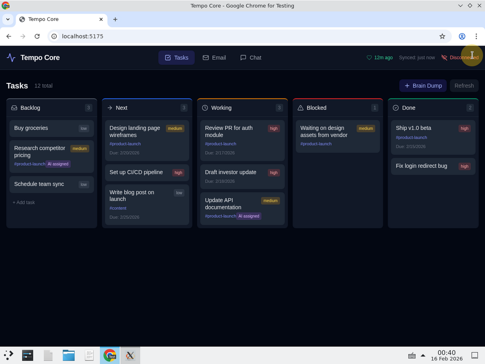
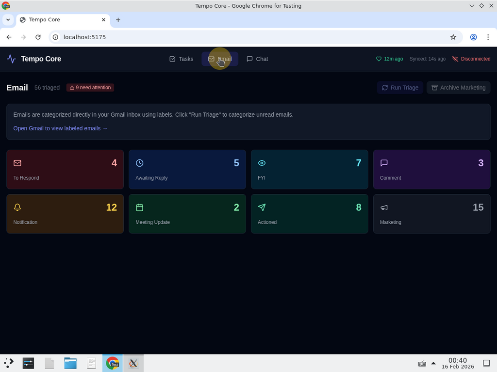
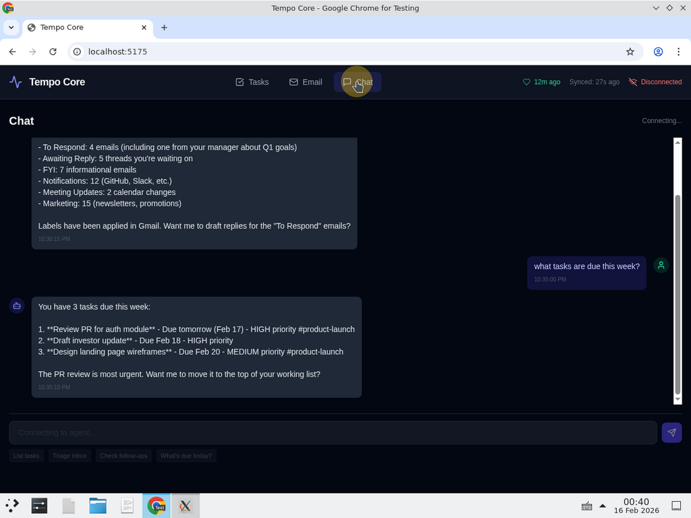

# OpenClaw Productivity Agent

A ready-to-run [OpenClaw](https://openclaw.com/) agent configuration with a dashboard UI, plugins, and skills for **task management** and **email management**. Built on Gmail and Obsidian — no database required. Compatible with **OpenClaw v2026.3.x** (and v2026.2.19+). See the [Changelog](CHANGELOG.md) for version history.

Originally extracted from [Tempo](https://github.com/jdanjohnson/tempo-assistant), a personal AI Chief of Staff system built by [Ja'dan Johnson](https://github.com/jdanjohnson), a designer and technologist focused on human-centered AI. This repo packages the core productivity features into a standalone, configurable starting point that anyone can fork, extend, and make their own.

## Screenshots

### Task Board — Kanban view with project tags, priorities, and AI-assigned tasks


### Email Summary — 8-category inbox triage with Gmail label counts


### Chat — Natural language agent interface with quick commands


---

## What's Included

This repo gives you a complete OpenClaw agent setup out of the box:

- **16 registered tools** — Task CRUD, email triage, follow-up tracking, board sync, and more via an OpenClaw plugin
- **2 skills** — `task-planner` (brain dump to structured tasks) and `email-composer` (draft replies)
- **Dashboard UI** — React/Vite/Tailwind command center with Kanban board, email overview, and agent chat
- **Heartbeat system** — Proactive 30-minute checks for deadlines, blocked work, and unanswered emails (with v2026.2.19 heartbeat guard)
- **Telegram integration** — Mobile notifications for heartbeat alerts
- **Vault template** — Ready-to-use Obsidian vault structure with Kanban board and task templates
- **QMD memory** — Queryable Markdown memory backend with hybrid search (BM25 + vectors + reranking)
- **Hooks engine** — Event-driven automation with bundled `command-logger` and `session-memory` hooks
- **Model fallbacks** — Automatic failover chain (Gemini 2.0 Flash -> Gemini 2.5 Flash -> GPT-4o Mini)
- **Compaction memory flush** — Automatically saves context before session compaction

**Design decisions:**
- **No database** — Gmail labels are your email categories. Obsidian markdown files are your tasks. Zero infrastructure.
- **Model fallbacks** — Runs on Gemini 2.0 Flash by default with automatic failover. Swap to any OpenClaw-supported model in one config line.
- **Meet users where they are** — Gmail and Obsidian are tools people already use. The agent organizes things behind the scenes.
- **Private** — Everything runs on your machine or your own server. Your emails and tasks never leave your control.

---

## Installation

### Prerequisites

| Requirement | Version | Check |
|---|---|---|
| [Node.js](https://nodejs.org/) | **v22+** | `node --version` |
| [npm](https://www.npmjs.com/) | **v10+** | `npm --version` |
| [OpenClaw](https://openclaw.com/) | **v2026.3.x** (v2026.2.19 minimum) | `openclaw --version` |
| [Git](https://git-scm.com/) | any | `git --version` |

**Platform integrations (configure after install):**

| Integration | Required? | What it does |
|---|---|---|
| Gmail API (OAuth) | Yes — for email management | Triage, label, draft replies |
| Google API key | Yes — for LLM | Powers the Gemini model |
| Obsidian vault | Yes — for task management | Markdown-based task storage |
| Telegram bot | Optional | Mobile heartbeat notifications |

> **New to OpenClaw?** Install it first: `npm install -g openclaw@latest`, then run `openclaw onboard` to walk through initial setup. See the [OpenClaw getting started guide](https://docs.openclaw.ai/getting-started).

### Step 1 — Clone and configure

```bash
git clone https://github.com/jdanjohnson/Openclaw-AI-Assistant-Project.git
cd Openclaw-AI-Assistant-Project
cp .env.example .env
```

Edit `.env` with your credentials:

```env
# Gmail OAuth (required for email management)
GMAIL_CLIENT_ID=your-client-id
GMAIL_CLIENT_SECRET=your-client-secret
GMAIL_REFRESH_TOKEN=your-refresh-token

# LLM (required)
GOOGLE_API_KEY=your-google-api-key

# Obsidian Vault (required for task management)
VAULT_PATH=/path/to/your/obsidian/vault

# Telegram (optional — enables mobile notifications)
TELEGRAM_BOT_TOKEN=your-bot-token
TELEGRAM_CHAT_ID=your-chat-id
```

> **Tip:** See [Gmail OAuth Setup](#gmail-oauth-setup) below for step-by-step instructions on getting your Gmail credentials.

### Step 2 — Set up your Obsidian vault

Copy the vault template into your Obsidian vault:

```bash
cp -r vault-template/* /path/to/your/obsidian/vault/
```

This creates:
- `Tasks/Board.md` — Kanban board (compatible with [Obsidian Kanban plugin](https://github.com/mgmeyers/obsidian-kanban))
- `Templates/Task.md` — Task file template with YAML frontmatter
- `Follow-Ups.md` — Follow-up tracking file
- `Projects/` — Project folder

### Step 3 — Install plugin dependencies

```bash
cd agent/plugins/core
npm install
```

Expected output: `added 57 packages` (no vulnerabilities).

### Step 4 — Start the agent

```bash
cd agent
openclaw gateway
```

The agent starts on port `18789` by default. You should see:

```
Gateway listening on http://localhost:18789
```

> **Note (v2026.2.19):** The gateway defaults to `auth.mode: "none"` for local use. If you expose the gateway externally through a reverse proxy, the `trustedProxies` config ensures WebSocket connections aren't rejected with "device identity required" errors. See the [Deployment](#deployment) section.

### Step 5 — Verify your setup

```bash
openclaw doctor
```

This checks your configuration, model access, plugin loading, and channel connectivity. Fix any warnings before proceeding.

### Step 6 — Start the dashboard (optional)

```bash
cd dashboard
npm install
npm run dev
```

Open [http://localhost:5173](http://localhost:5173) to access the command center.

### Step 7 — Test the agent

Once the gateway is running, try these commands via Telegram or the dashboard chat:

- **"list my tasks"** — verify task management works
- **"triage my inbox"** — verify email management works
- **"what's due today?"** — verify heartbeat-style checks work

If all three work, your setup is complete.

---

## Gmail OAuth Setup

To enable email management, you need Gmail API credentials:

### Step 1: Create a Google Cloud project

1. Go to [Google Cloud Console](https://console.cloud.google.com/)
2. Create a new project (or select an existing one)
3. Enable the **Gmail API** under APIs & Services > Library

### Step 2: Create OAuth credentials

1. Go to APIs & Services > Credentials
2. Click **Create Credentials** > **OAuth client ID**
3. Application type: **Web application**
4. Add `http://localhost:3000/callback` as an authorized redirect URI
5. Copy the **Client ID** and **Client Secret** into your `.env`

### Step 3: Get a refresh token

Use the [OAuth 2.0 Playground](https://developers.google.com/oauthplayground/) or run a local OAuth flow:

1. Go to [OAuth Playground](https://developers.google.com/oauthplayground/)
2. Click the gear icon, check "Use your own OAuth credentials"
3. Enter your Client ID and Client Secret
4. In Step 1, select `https://mail.google.com/` scope
5. Authorize and exchange for tokens
6. Copy the **Refresh Token** into your `.env`

### Gmail labels

On first run, the agent automatically creates these labels in your Gmail:

| Label | Purpose |
|---|---|
| To Respond | Emails requiring your reply |
| FYI | Informational, no action needed |
| Comment | Someone commented on a PR, doc, thread |
| Notification | Automated system notifications |
| Meeting Update | Calendar/meeting related |
| Awaiting Reply | You're waiting for someone else |
| Actioned | Already handled |
| Marketing | Promotional, newsletters, cold outreach |

---

## Telegram Setup (Optional)

For mobile notifications and heartbeat alerts:

1. Message [@BotFather](https://t.me/BotFather) on Telegram
2. Create a new bot with `/newbot`
3. Copy the bot token into `TELEGRAM_BOT_TOKEN`
4. Start a chat with your bot, then get your chat ID:
   ```
   https://api.telegram.org/bot<YOUR_TOKEN>/getUpdates
   ```
5. Copy the chat ID into `TELEGRAM_CHAT_ID`
6. Update `agent/openclaw.json` — set `channels.telegram.chatId` to your chat ID

---

## Project Structure

```
├── agent/                          # OpenClaw agent configuration
│   ├── openclaw.json               # Agent config (model, memory, hooks, heartbeat, Telegram)
│   ├── plugins/core/               # Plugin with 16 registered tools
│   │   ├── index.ts                # Tool registration via api.registerTool()
│   │   ├── openclaw.plugin.json    # Plugin manifest (required by OpenClaw v2026.2.19+)
│   │   └── package.json            # Dependencies (typebox, googleapis, gray-matter)
│   ├── lib/                        # Core libraries
│   │   ├── vault-sync.ts           # Board.md ↔ task file synchronization
│   │   ├── vault-tasks.ts          # Task CRUD (create, list, update, complete, archive, delete)
│   │   ├── gmail-adapter.ts        # Gmail API OAuth adapter
│   │   ├── gmail-email.ts          # Email triage + categorization tools
│   │   └── follow-up-tracker.ts    # Follow-up detection + vault writer
│   └── workspace/                  # Agent behavior definitions
│       ├── SOUL.md                 # Assistant identity and rules
│       ├── HEARTBEAT.md            # 5-priority proactive check system
│       └── skills/                 # Specialized capabilities
│           ├── task-planner/       # Brain dump → structured tasks
│           └── email-composer/     # Draft email replies
├── dashboard/                      # React command center
│   ├── src/
│   │   ├── App.tsx                 # Main app (3 tabs: Tasks, Email, Chat)
│   │   ├── components/
│   │   │   ├── TaskBoard.tsx       # Kanban board with brain dump
│   │   │   ├── EmailSummary.tsx    # 8-category email overview
│   │   │   ├── ChatPanel.tsx       # Agent chat interface
│   │   │   └── HeartbeatStatus.tsx # Heartbeat indicator
│   │   └── lib/
│   │       ├── agent-api.ts        # WebSocket agent communication
│   │       └── types.ts            # Shared TypeScript types
│   ├── package.json
│   └── vite.config.ts
├── vault-template/                 # Example Obsidian vault structure
│   ├── Tasks/Board.md              # Kanban board
│   ├── Templates/Task.md           # Task template with frontmatter
│   ├── Follow-Ups.md               # Follow-up tracking
│   └── Projects/                   # Project folder
├── .env.example                    # Required environment variables template
└── README.md
```

---

## How It Works

### Task Management

Tasks live as markdown files in your Obsidian vault with YAML frontmatter:

```markdown
---
status: working
assignee: me
priority: high
project: product-launch
due_date: 2026-02-20
created_at: 2026-02-15T10:00:00Z
tags: [urgent, design]
---

Review the landing page mockups and provide feedback to the design team.
```

The agent keeps `Tasks/Board.md` (Obsidian Kanban plugin format) in sync with individual task files. Edit either one — the sync engine reconciles them.

**Task statuses:** `backlog` → `next` → `working` → `done` (with `blocked` and `archived`)

**Tools available:**
- `create_task` — Create a new task
- `list_tasks` — List/filter tasks
- `update_task` — Modify any field
- `complete_task` — Mark as done
- `archive_task` — Move to Archive/
- `delete_task` — Permanently remove
- `sync_board` — Force Board.md ↔ file sync
- `list_projects` / `create_project` — Project management

### Email Management

The agent categorizes your unread emails and applies Gmail labels directly — your inbox becomes organized without copying emails into a database.

**Flow:**
1. You say "triage my inbox" (or heartbeat triggers it)
2. Agent fetches unread emails via Gmail API
3. LLM categorizes each email into one of 8 categories
4. Gmail labels are applied automatically
5. For "To Respond" emails, the agent can draft replies (saved as Gmail drafts, never auto-sent)

**Tools available:**
- `run_email_triage` — Categorize and label unread emails
- `list_emails` — Search Gmail
- `read_email` — Read full email content
- `send_email` / `create_draft` — Create drafts in Gmail

### Follow-up Tracking

Combines Gmail labels with an Obsidian file:
- Scans "To Respond" and "Awaiting Reply" labels in Gmail
- Writes a human-readable `Follow-Ups.md` in your vault
- Flags overdue items (1 day for needs-reply, 3 days for awaiting-reply)

### Heartbeat System

Every 30 minutes (configurable), the agent runs 5 priority checks:

1. **Approaching deadlines** — Tasks due within 24 hours
2. **Blocked tasks** — Tasks stuck in `blocked` status
3. **Overdue follow-ups** — Emails waiting too long for replies
4. **WIP overflow** — More than 5 tasks in `working` status
5. **Unread To-Respond** — Emails labeled "To Respond" still unread

Results are sent via Telegram (if configured) as a single consolidated message.

---

## Configuration

### Changing the LLM model

Edit `agent/openclaw.json`:

```json
{
  "agents": {
    "defaults": {
      "model": {
        "primary": "google/gemini-2.0-flash",
        "fallbacks": [
          "google/gemini-2.5-flash",
          "openai/gpt-4o-mini"
        ]
      }
    }
  }
}
```

Replace `primary` with any model supported by OpenClaw (OpenAI, Anthropic, Mistral, etc.). The `fallbacks` array provides automatic failover if the primary model is unavailable.

### Heartbeat frequency

In `agent/openclaw.json`:

```json
{
  "heartbeat": {
    "every": "30m",
    "activeHours": {
      "start": "08:00",
      "end": "23:00",
      "timezone": "America/New_York"
    }
  }
}
```

### QMD Memory

The agent uses Queryable Markdown (QMD) as its memory backend, enabling hybrid search across workspace markdown files:

```json
{
  "memory": {
    "backend": "qmd",
    "qmd": {
      "limits": { "maxResults": 6, "timeoutMs": 4000 },
      "sessions": { "enabled": true, "retentionDays": 30 }
    }
  }
}
```

Memory files in `workspace/memory/` are automatically indexed and searchable.

### Hooks

Two bundled hooks are enabled by default:

| Hook | Purpose |
|---|---|
| `command-logger` | Logs all tool usage for debugging |
| `session-memory` | Persists important context before session compaction |

Add custom hooks by creating directories in `workspace/hooks/` with a `HOOK.md` frontmatter file and optional `handler.js`.

### Compaction memory flush

When a session approaches the token limit, the agent automatically saves important context before compaction:

```json
{
  "agents": {
    "defaults": {
      "compaction": {
        "memoryFlush": {
          "enabled": true,
          "softThresholdTokens": 4000
        }
      }
    }
  }
}
```

### Dashboard gateway URL

Create `dashboard/.env`:

```env
VITE_GATEWAY_URL=ws://localhost:18789
```

---

## Deployment

### Local (simple + private)

The installation guide above runs everything locally. This is the simplest setup.

### DigitalOcean 1-Click droplet (recommended for always-on)

If you want your agent running 24/7 (heartbeats, Telegram notifications, always-available chat), the easiest path is the **OpenClaw DigitalOcean 1-Click** image.

**Architecture:**

```
  You (laptop)
    │
    ├── git push ──────► GitHub (backup + version history)
    │                       │
    │                       ├── GitHub Actions (auto-deploy)
    │                       │       │
    │                       │       ▼
    │                    DigitalOcean Droplet
    │                    ┌──────────────────────┐
    │    SSH ───────────►│  OpenClaw Gateway     │
    │                    │  (agent execution)    │
    │                    │  Caddy (HTTPS)        │
    │                    └──────────┬───────────┘
    │                               │ wss://
    │                               ▼
    └── browser ──────► Vercel (dashboard UI, free)
```

- **Droplet** runs the OpenClaw gateway (execution)
- **GitHub** stores your config (backup + version history)
- **GitHub Actions** keeps the droplet in sync (auto-deploy on push)
- **Vercel** hosts the dashboard UI (free)
- **Caddy** provides automatic HTTPS (free Let's Encrypt certs)

#### Step 1 — Provision the droplet

1. Create a droplet from the OpenClaw 1-Click image.
2. SSH in:

```bash
ssh root@YOUR_DROPLET_IP
```

3. Ensure OpenClaw is current:

```bash
npm install -g openclaw@latest
openclaw --version
```

#### Step 2 — Put your config on GitHub (backup)

1. Fork this repo on GitHub
2. Clone your fork to your laptop
3. Pull your droplet config into the repo (so GitHub becomes your backup):

```bash
scp -r root@YOUR_DROPLET_IP:/home/openclaw/.openclaw/workspace/ ./agent/workspace/
scp root@YOUR_DROPLET_IP:/home/openclaw/.openclaw/openclaw.json ./agent/openclaw.json

# Optional but recommended if you're using the plugin tools
scp -r root@YOUR_DROPLET_IP:/home/openclaw/.openclaw/plugins/ ./agent/plugins/
scp -r root@YOUR_DROPLET_IP:/home/openclaw/.openclaw/lib/ ./agent/lib/

git add agent/
git commit -m "Back up my OpenClaw config"
git push
```

#### Step 3 — Set up auto-deploy with GitHub Actions

This repo includes a workflow at `.github/workflows/deploy.yml` that syncs your config to your droplet on every push to `main`.

Add these GitHub secrets (Repo > Settings > Secrets and variables > Actions):

| Secret | What it is | How to get it |
|---|---|---|
| `DROPLET_SSH_KEY` | Private SSH key used by Actions | your laptop: `cat ~/.ssh/id_ed25519` |
| `DROPLET_KNOWN_HOSTS` | Server fingerprint | `ssh-keyscan YOUR_DROPLET_IP` |
| `DROPLET_HOST` | Droplet IP address | DigitalOcean dashboard |
| `DROPLET_USER` | SSH username | `root` |

**Test it:** make a small change (like a line in `agent/workspace/SOUL.md`), commit, push, then watch the Actions run.

#### Step 4 — Deploy the dashboard (Vercel + HTTPS)

The dashboard is a static Vite app in `dashboard/`. You can deploy it to Vercel for free.

1. **Set up HTTPS reverse proxy on your droplet** (needed for secure WebSocket `wss://`):

```bash
# Install Caddy
sudo apt install -y debian-keyring debian-archive-keyring apt-transport-https
curl -1sLf 'https://dl.cloudsmith.io/public/caddy/stable/gpg.key' | sudo gpg --dearmor -o /usr/share/keyrings/caddy-stable-archive-keyring.gpg
curl -1sLf 'https://dl.cloudsmith.io/public/caddy/stable/debian.deb.txt' | sudo tee /etc/apt/sources.list.d/caddy-stable.list
sudo apt update && sudo apt install caddy

# Caddyfile
sudo tee /etc/caddy/Caddyfile << 'EOF'
agent.yourdomain.com {
    reverse_proxy 127.0.0.1:18789
}
EOF

sudo systemctl restart caddy
```

2. **Allow your Vercel domain** in `agent/openclaw.json`:

```json
{
  "gateway": {
    "controlUi": {
      "allowedOrigins": [
        "http://localhost:5173",
        "https://replace-me.invalid"
      ]
    }
  }
}
```

> Replace `https://replace-me.invalid` with your actual Vercel domain (for example: `https://my-assistant.vercel.app`).

3. **Deploy to Vercel**:
   - Import your fork
   - Root Directory: `dashboard`
   - Add env var: `VITE_GATEWAY_URL=wss://agent.yourdomain.com`

> No domain yet? Use an SSH tunnel instead:
> ```bash
> ssh -L 18789:localhost:18789 root@YOUR_DROPLET_IP
> # Then open http://localhost:18789
> ```

### Reverse proxy notes (IPv6 + trusted proxies)

Use `127.0.0.1:18789` (not `localhost:18789`) in your reverse proxy config to avoid IPv6 resolution issues. The default `gateway.trustedProxies` in `agent/openclaw.json` includes `127.0.0.1` and `::1` for local proxy setups.

---

## Contributing

Contributions are welcome. Here's how to get involved.

### Getting started

1. **Fork the repo** and clone your fork
2. **Set up your environment** — follow the [Installation](#installation) guide above
3. **Create a branch** for your feature or fix:
   ```bash
   git checkout -b feature/your-feature-name
   ```
4. **Make your changes** — keep commits focused and descriptive
5. **Test locally** — make sure the agent starts and the dashboard builds:
   ```bash
   cd dashboard && npm run build
   cd agent && openclaw gateway
   ```
6. **Open a pull request** against `main` with a clear description of what you changed and why

### Areas for contribution

**New adapters:**
- IMAP/SMTP adapter for non-Gmail email providers
- Microsoft Outlook adapter (Graph API)
- CalDAV adapter for calendar integration

**New skills:**
- Meeting briefer — cross-reference calendar with tasks and contacts
- Research assistant — web search + summarization
- Weekly review generator — automated retrospectives

**Dashboard improvements:**
- File-watcher daemon for real-time vault change detection (currently agent-polled)
- Task detail drawer with inline editing
- Email thread viewer
- Dark/light theme toggle

**Infrastructure:**
- Multi-user authentication layer
- Docker Compose setup for one-command deployment
- Mobile companion app (React Native)
- Webhook integrations (GitHub, Linear, Slack)

### Code conventions

- TypeScript for all agent code and dashboard
- All plugin tools must return `jsonResult()` format
- Email content must be wrapped in `<untrusted_email_data>` tags before LLM processing
- No hardcoded API keys, email addresses, or personal references
- Prefer editing existing files over creating new ones

### Reporting issues

Open a [GitHub issue](https://github.com/jdanjohnson/Openclaw-AI-Assistant-Project/issues) with:
- Steps to reproduce
- Expected vs actual behavior
- Your environment (Node version, OS, OpenClaw version — should be v2026.3.x)

---

## Troubleshooting

Common issues and their solutions. Run `openclaw doctor` first — it catches most configuration problems automatically.

| Symptom | Cause | Fix |
|---|---|---|
| `gateway.auth.mode is required` | OpenClaw < v2026.2.19 | Upgrade: `npm install -g openclaw@latest` |
| `device identity required` on WebSocket | Missing `trustedProxies` behind reverse proxy | Add your proxy IP to `gateway.trustedProxies` in `openclaw.json` |
| `Cannot find module '@sinclair/typebox'` | Plugin dependencies not installed | Run `cd agent/plugins/core && npm install` |
| Dashboard shows "Disconnected" | Gateway not running | Start the gateway: `cd agent && openclaw gateway` |
| `GOOGLE_API_KEY is not set` | Missing `.env` file | Copy `.env.example` to `.env` and fill in your credentials |
| Heartbeat not firing | Outside active hours or `HEARTBEAT.md` empty | Check `activeHours` in `openclaw.json` and ensure `HEARTBEAT.md` has content |
| Gmail labels not created | OAuth credentials invalid | Re-run the [Gmail OAuth Setup](#gmail-oauth-setup) steps |
| `model not found` error | Model string doesn't match OpenClaw format | Use provider-prefixed format: `google/gemini-2.0-flash`, `openai/gpt-4o-mini` |
| Fallback models not triggering | API key valid but model overloaded | Fallbacks only trigger on errors, not on slow responses. Check `openclaw doctor` for model status |
| Plugin tools not registering | Missing `openclaw.plugin.json` manifest | Ensure `agent/plugins/core/openclaw.plugin.json` exists (required by v2026.2.19+) |

For issues not listed here, open a [GitHub issue](https://github.com/jdanjohnson/Openclaw-AI-Assistant-Project/issues) or check the [OpenClaw troubleshooting docs](https://docs.openclaw.ai/troubleshooting).

---

## Background

This project started as [Tempo](https://github.com/jdanjohnson/tempo-assistant), a personal AI Chief of Staff built by [Ja'dan Johnson](https://github.com/jdanjohnson). Ja'dan is a designer and technologist who works at the intersection of human-centered design and AI — exploring how intelligent systems can reduce the cognitive overhead between what you intend to do and what your tools actually help you accomplish.

This repo extracts the task and email management pieces into a generic, configurable starting point built on [OpenClaw](https://openclaw.com/). The goal is to give others a foundation to build their own AI productivity workflows — adapt the skills, swap the model, extend the tools, and make it yours.

### OpenClaw v2026.3.x Compatibility

This repo tracks the latest stable OpenClaw release. Key features used:

- **QMD memory backend** — Hybrid search (BM25 + vectors + reranking) over workspace markdown files
- **Hooks engine** — Event-driven automation (`command-logger`, `session-memory`, custom hooks)
- **Plugin manifests** — `openclaw.plugin.json` for structured plugin discovery
- **Model fallbacks** — Automatic failover chain across providers
- **Gateway auth hardening** — Explicit `auth.mode: "none"` for loopback setups (prevents token auth breaking connections)
- **Heartbeat guard** — Skips interval heartbeats when `HEARTBEAT.md` is missing/empty
- **Compaction memory flush** — Saves important context before session compaction
- **Trusted proxies** — `gateway.trustedProxies` for reverse proxy setups (fixes "device identity required" errors)
- **Config validation** — `openclaw config validate` catches misconfigurations before they reach runtime
- **Telegram streaming** — `streamMode: "partial"` for real-time response delivery
- **Security audit** — `openclaw security audit --fix` for automated DM pairing + firewall recommendations

---

## License

MIT
